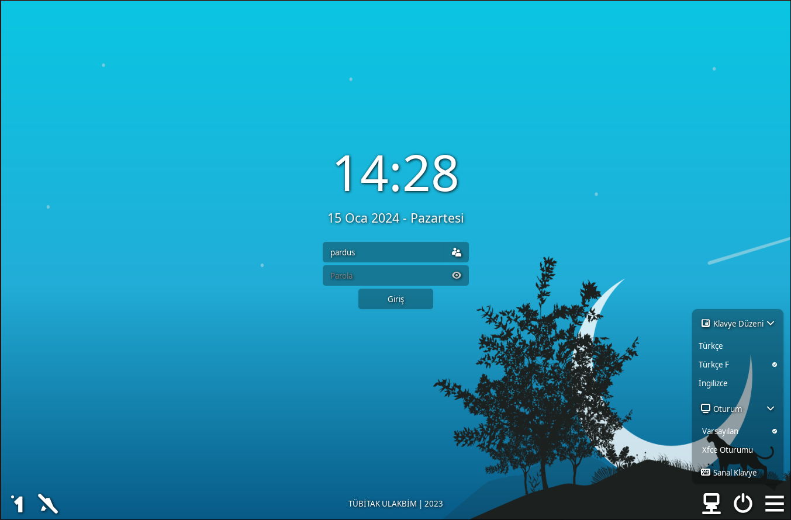

# Pardus lightdm greeter
A powerfull, modern and customizable lightdm greeter for Pardus GNU/Linux.

# Features
* UI Scale 
* Icon and gtk theme changing 
* Debug mode
* Can run initial command before loading
* Can run command before login
* Can block root login
* Can block autologin
* Keyboard layout switcher
* On screen keyboard
* Numlock/Capslock state indicator
* Can enable numlock on start
* Empty password login
* Login without enter (password cache)
* Custom logo 
* Custom background 
* Use user bacrground 
* Multiple display 
* Can change default monitor
* User list 
* Remove user from list 
* Ignore user 
* Show realname as username 
* Custom clock format 
* Custom date format
* Show local and public ip adress
* Custom action buttons for running any commands
* Load config from conf.d files
* For more features, additional module support

**All features can configurable from /etc/pardus/greeter.conf**

**You can create your own configuration like /etc/pardus/greeter.conf.d/example.conf**

# Dependencies
* gir1.2-lightdm-1
* python3-x11
* gir1-2-gtk-3.0
* lightdm

# installation
```shell
# Compile
meson setup build
ninja -C build
# install
ninja -C build install
```


